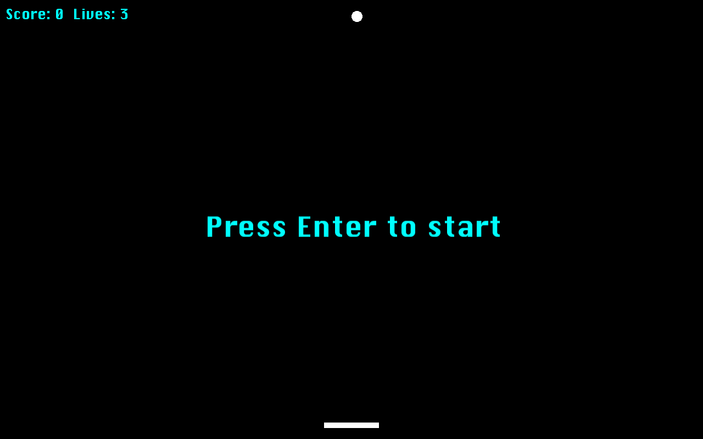
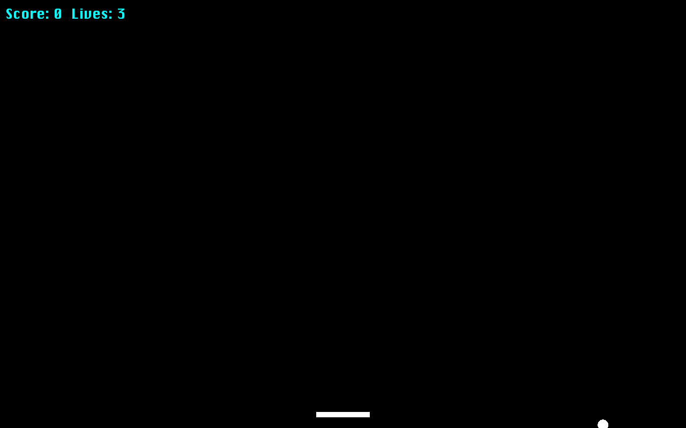

# Pong Game

A single player paddle and ball survival game built in C++ with SFML where the ball bounces off the walls and your paddle, rack up a point per hit and don't let it slip past the bottom.



## Overview

The ball drops from the top of the screen and bounces off the left wall, right wall and ceiling automatically. Your job is to keep it off the floor using a paddle you control left and right at the bottom of the screen. Every successful hit adds to your score; missing one costs a life. Lose all 3 lives and it's game over then press Enter to try again.



It's a deliberately small, focused build with full game loop, physics and state handling in under 150 lines across three files.

## Features

- **Full game loop** — menu state, active play and game over state, all driven by a couple of booleans rather than a heavyweight state machine
- **Resolution aware fullscreen window** — reads the player's actual desktop resolution at launch and sizes the play field to match, rather than assuming a fixed window size
- **Delta time movement** — both the ball and paddle move using frame delta time (`dt.asSeconds()`), so speed stays consistent regardless of frame rate
- **Wall, ceiling and paddle collision** — the ball reverses direction off the left/right walls and ceiling and bounces back up on paddle contact (detected via `FloatRect::intersects()`)
- **Live HUD** — score and remaining lives rendered in the corner and updated every frame
- **Lives & reset logic** — missing the ball resets its position and decrements lives instead of ending the game outright until lives hit zero

## Tech Stack

- **C++17**
- **SFML 2.x** (`Graphics` + `Window` + `System` modules)

## Architecture

- **`Ball.h` / `Ball.cpp`** — owns the ball's position, direction and speed. Exposes `bounceSides()`, `bounceTop()`, `bounceByBat()` and `reset()` so `Game.cpp` only has to decide *when* a bounce happens, not *how*.
- **`Bat.cpp`** — the paddle. Tracks movement flags (`m_MovingLeft` / `m_MovingRight`) that get set by continuous key state checks each frame then applies movement in `update()`, clamped so it can't run off either edge of the screen.
- **`Game.cpp`** — the main loop: handles window events, polls continuous key state for paddle movement, runs collision checks against the ball each frame and draws everything.

## Getting Started

### Requirements

- A C++17-capable compiler (g++, clang)
- [SFML](https://www.sfml-dev.org/download.php) (2.5+) installed and linkable

### Build (Linux, g++)

```bash
g++ Game.cpp -o PongGame -lsfml-graphics -lsfml-window -lsfml-system -lsfml-audio
./PongGame
```

Run it from the project root and fonts are loaded via the relative path `fonts/`, so the binary needs to be launched from there.

### Build (Windows)

Set up SFML in your IDE of choice (Visual Studio or Code::Blocks both have standard SFML setup guides), add `Game.cpp` to a project alongside `Ball.h`/`Ball.cpp`/`Bat.cpp`, link the SFML libraries and build.

## Controls

| Key | Action |
|---|---|
| `Enter` | Start / restart after game over |
| `←` | Move paddle left |
| `→` | Move paddle right |
| `Esc` | Quit |

## Possible Next Steps

- Increase ball speed slightly with each successful hit for a difficulty ramp
- Vary the bounce angle based on where the ball hits the paddle instead of always bouncing straight back
- Persist a high score across sessions
- Swap the text based lives counter for the heart icon already sitting unused in `graphics/`

## Conclusion

Built solo as a C++/SFML practice project with physics, collision handling and state management all written from scratch.
